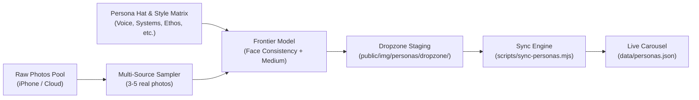

# Persona Generation & Visage Evolution Architecture

> **Design Principle**: Persona renditions must feel intentional, varied, and grounded in authentic personal reality—never hurried or repetitively synthesized from a narrow, single-image source pool.

---

## 1. Problem Statement & Evolution

### The Limitation of Single-Source Generation

When an AI generator relies on only one reference (e.g., a single stylized avatar), the resulting renditions suffer from "clone syndrome":

- Identical facial geometry, jawline angle, and rigid cartoon features.
- Monotonous art style across completely different professional disciplines.
- A synthetic, hurried appearance that lacks the texture and depth of an actual person's multifaceted life.

### The Desired Paradigm: Living Multi-Source Visage Pool

Instead of forcing a single cartoon reference into five uniform variations:

1. **Source Visage Pool**: Maintain an unconstrained, expanding directory of genuine real-world photos (`public/img/personas/sources/`) collected from iPhone camera rolls, Google Photos, Amazon Photos, and past professional archives.
2. **Evolving Visage**: As time passes, new photos capture changing hairstyles, beard trims, eyewear, age, environments, and expressions.
3. **Multi-Model & Multi-Medium Blending**: An automated or periodic task samples from this real-life source pool and blends it with role-specific concepts using varied, deliberate art directions (e.g., editorial portraiture, architectural drafting washes, risograph prints, cyberpunk concept art, warm documentary photography).
4. **Scheduled Evolution ($M$ Weeks)**: Every $M$ weeks, or when new source photos are added, the pipeline cycles or generates fresh, increasingly accurate and nuanced renditions that evolve with both the subject and the frontier generative models.

---

## 2. Directory Architecture

```
kielbyrne.com/
├── public/
│   └── img/
│       └── personas/
│           ├── sources/            # <-- REAL VISAGE SOURCE POOL (iPhone, Google/Amazon Photos)
│           │   ├── README.md       # Guidance on formats, resolutions, and varied angles
│           │   └── .gitkeep
│           ├── dropzone/           # <-- Finished artwork or one-off images ready to auto-sync
│           ├── code-ronin.png      # Active carousel artwork
│           ├── strategic-consultant.jpg
│           └── ...
├── data/
│   ├── personas.json               # Active carousel roster & metadata manifest
│   └── personas.ts                 # TypeScript interface & exports
├── scripts/
│   ├── sync-personas.mjs           # Moves dropzone images into carousel & updates personas.json
│   └── generate-ai-persona.mjs     # Pipeline script for source-mixing & prompt generation
└── .github/
    └── workflows/
        └── personas-automation.yml # Scheduled bi-weekly GitHub Action trigger
```

---

## 3. The Visage Source Pool (`sources/`)

### What Goes In:

- **Candid & Real-World**: Photos taken outdoors, in coffee shops, home office, on travels, behind microphones, at family gatherings.
- **Different Lighting**: Natural sunlight, moody studio keylights, golden hour, indoor ambient lighting.
- **Varied Expressions & Angles**: Smiles, contemplative focus, profile angles, 3/4 turns, full frontals.
- **Formats**: High-resolution `.jpg`, `.jpeg`, `.png`, `.heic` (converted to jpg/png), or `.webp`.

### How Models Use It:

When feeding multi-image reference models (such as Gemini Imagen, IP-Adapter, InstantID, or Midjourney `--cref`), supplying 3–5 varied real-world photos enables the model to extract **true facial invariants** (eye shape, smile lines, bone structure) rather than overfitting to a single drawing's flat contours.

---

## 4. Automation & Generation Schedule ($M$ Weeks)

### Workflow Trigger

1. **Cron Schedule**: Runs automatically every $M$ weeks (default configured to bi-weekly: 1st and 15th of each month) via GitHub Actions ([`personas-automation.yml`](../.github/workflows/personas-automation.yml)).
2. **On-Demand**: Triggered manually anytime via `npm run personas:generate` or GitHub `workflow_dispatch`.

### Generation Steps



1. **Sampler**: Selects 2–4 diverse photos from `sources/`.
2. **Dimension Selection**: Chooses a dimension ("Voiceover & Sound", "Systems Architecture", "Physical Design", "Community & Ethos", "Retro QA").
3. **Style Infusion**: Pairs the dimension with an artistic medium tailored to that theme (not uniform anime across all):
   - _Systems & Telemetry_: Neo-Tokyo blueprint or clean isometric vector.
   - _Voice Talent_: Atmospheric jazz-club chiaroscuro or vintage radio aesthetic.
   - _Physical Engineering_: Technical drafting watercolor or retro CAD wireframe.
   - _Community & The MOBB_: Vibrant street mural or warm documentary medium format.
4. **Ingestion**: The generated image and sidecar `.json` are written to `dropzone/`.
5. **Sync**: `npm run personas:sync` validates the image, optimizes it, and updates `data/personas.json`.
